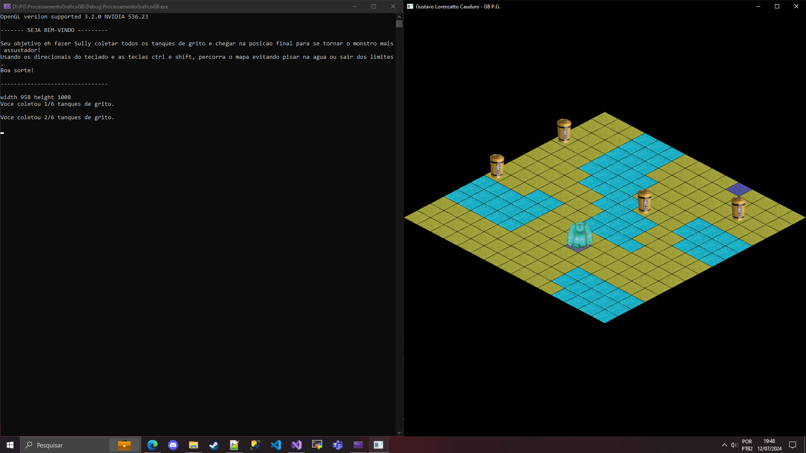

# Processamento Gráfico - GB

## Tarefa | Jogo com Visão Isométrica

### Instruções

Para a execução do jogo, é necessário configurar as dependências corretamente. Elas encontram-se na pasta "Dependencies".

### Resultado

Ao executar corretamente a aplicação, o jogo será aberto e as instruções serão fornecidas conforme imagem abaixo:

